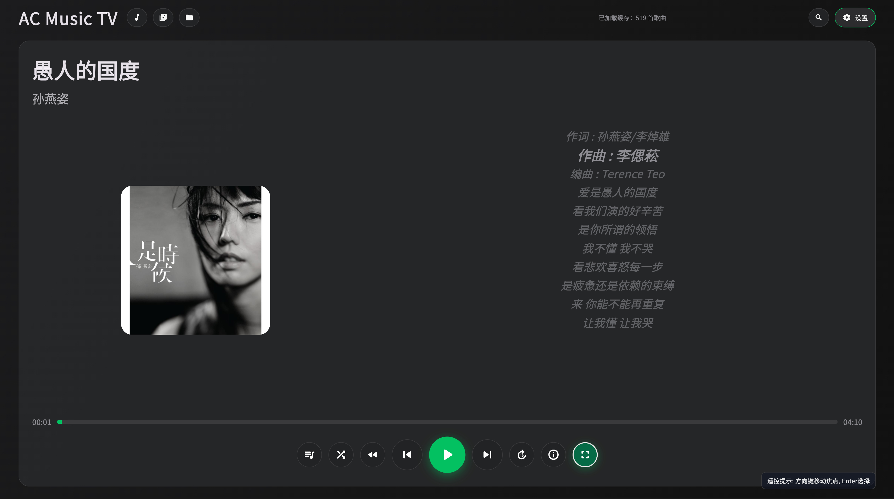
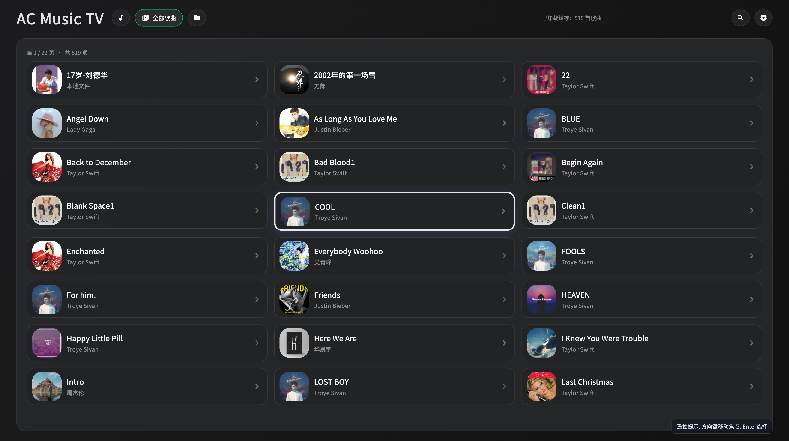
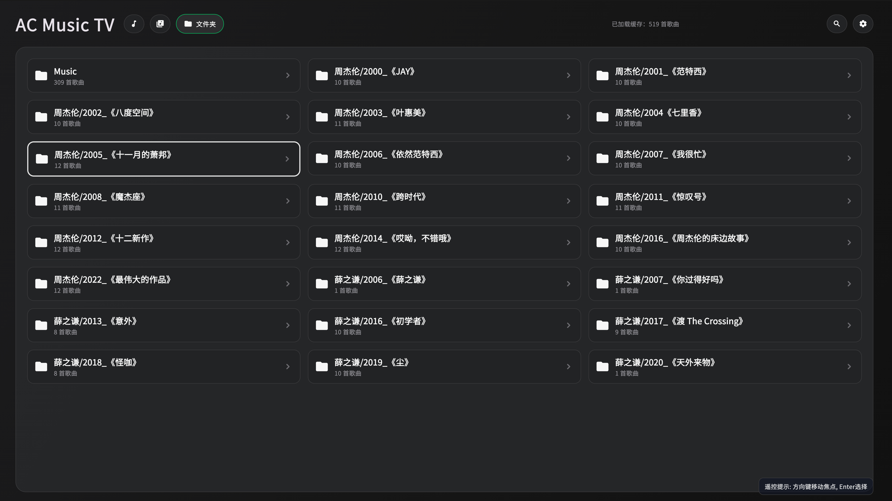
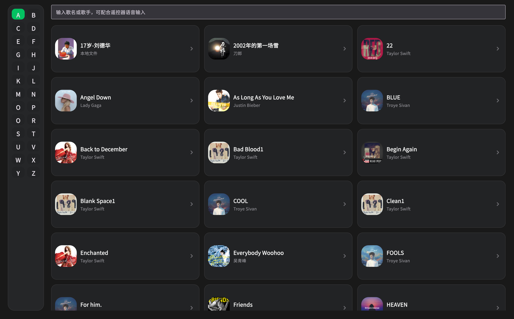
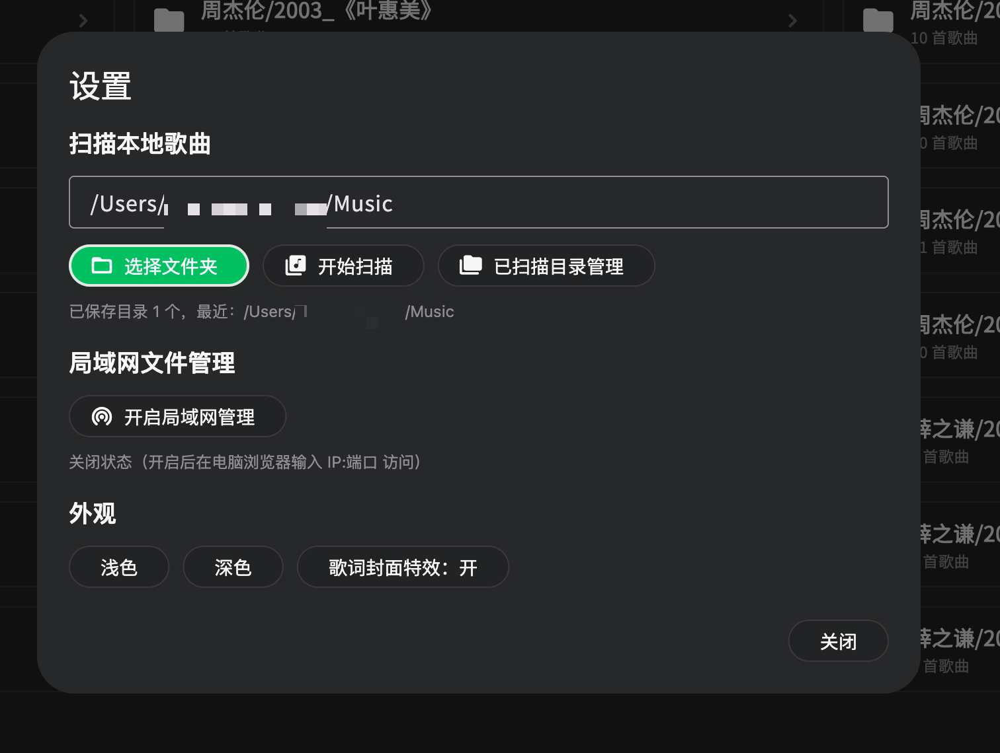
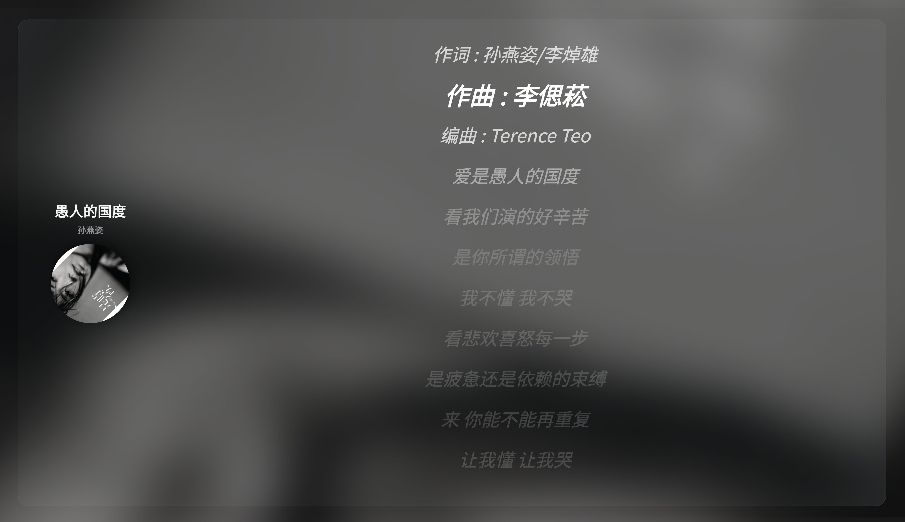

# AC Music

<p align="center">
  <a href="https://flutter.dev/"></a>
  <a href="https://dart.dev/"></a>
  <a href="https://developer.android.com/"></a>
  <a href="LICENSE"></a>
  
</p>

<p align="center">
  <b>Local music player for TV &amp; desktop</b><br/>
  <sub>Flutter · Local library · Lyrics · LAN HTTP</sub>
</p>

<p align="center">
  <b>中文</b>：<a href="README.md">README.md</a>
</p>

---

## Screenshots

Screenshots are stored under `docs/screenshots/` as **JPG** files. See [docs/screenshots/README.md](docs/screenshots/README.md) for the full index.

<p align="center">
  <br/>
  <sub>Main player · <code>player_main.jpg</code></sub>
</p>

<p align="center">
  <br/>
  <sub>Library / all songs · <code>library_tv.jpg</code></sub>
</p>

<p align="center">
  
  <br/>
  <sub>File manager · Search</sub>
</p>

<p align="center">
  
  <br/>
  <sub>Settings · Fullscreen lyrics</sub>
</p>

---

## Overview

**AC Music** is a Flutter **local music player** with a **remote / D-pad friendly** TV-style UI, runnable on phones and **Android TV** (Leanback). It scans audio files under a chosen folder recursively, reads embedded & external tags, parses **LRC** lyrics, and optionally starts a **LAN HTTP file server** (port + basic auth) for the current library root.

**Version:** `1.0.2+1` (see `pubspec.yaml`)

## Features

| Area | Description |
|------|-------------|
| **Library** | Recursive scan, folder history, progress, cached results |
| **Playback** | `just_audio`, queue, shuffle/repeat modes, progress & cover art |
| **Metadata & lyrics** | Tags; embedded/external LRC with fullscreen lyrics |
| **Theming** | Light / dark / system; dark theme uses neutral grays + green accent (WeChat-like) |
| **Android TV** | `LEANBACK_LAUNCHER` for set-top / large screens |
| **LAN** | Optional HTTP server with configurable credentials |
| **Persistence** | `shared_preferences` for theme, folders, playback state |

## Supported formats (examples)

`mp3`, `flac`, `wav`, `m4a`, `aac`, `ogg`, `wma`, `aiff`, `ape`, `alac`, `opus` — exact set follows the app’s extension list.

## Requirements

- **Flutter** SDK `^3.11.5`
- Primary target: **Android**; validate other platforms with `flutter devices` and dependency checks.

## Quick start

```bash
git clone https://github.com/Xianxingxing/AC_Music.git
cd AC_Music
flutter pub get
flutter run
```

## Build release APK

```bash
flutter build apk --release
```

Output: `build/app/outputs/flutter-apk/app-release.apk`

## Android permissions

See `android/app/src/main/AndroidManifest.xml`. Grant storage / audio permissions if scanning fails.

## License

Distributed under the **[MIT License](LICENSE)**.

## Acknowledgements

[Flutter](https://flutter.dev/) and all open-source package authors.

<p align="center">If this project helps you, a ⭐ is appreciated.</p>
